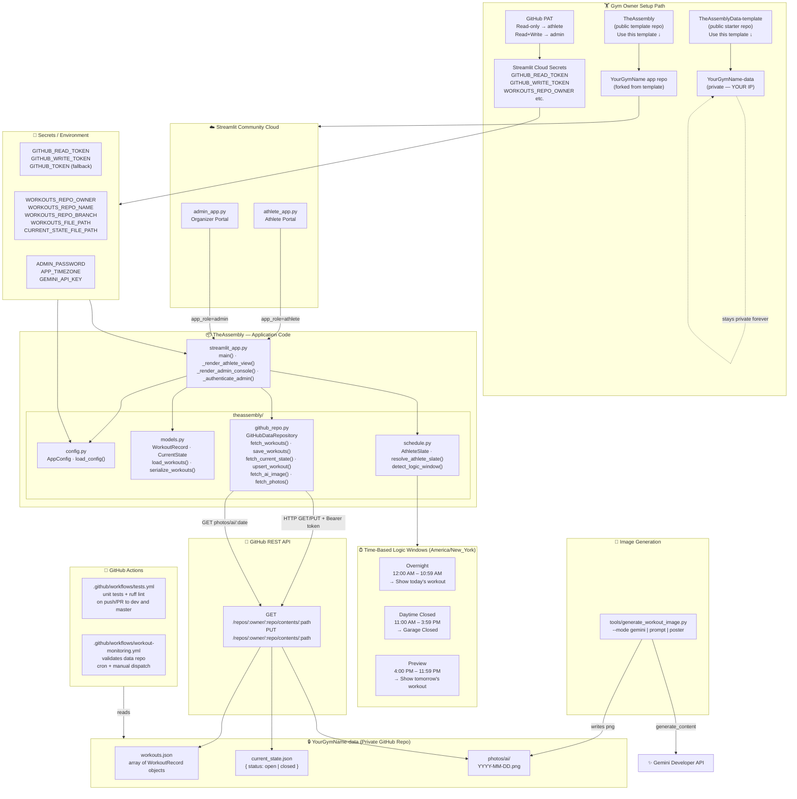
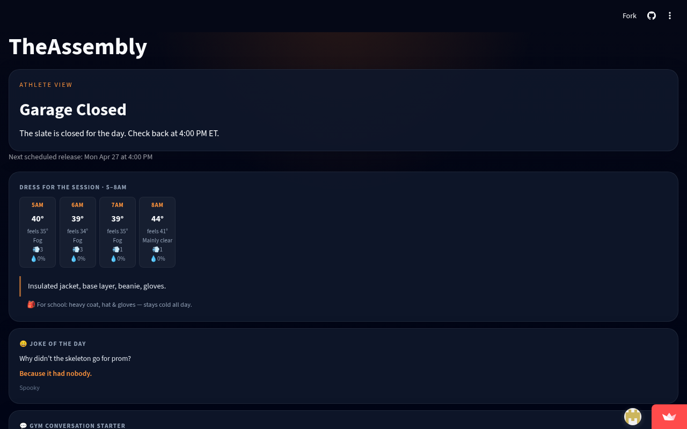

# TheAssembly

A privacy-first gym whiteboard built for Streamlit Community Cloud. Athletes see today's workout. You control what's on the board.

## Architecture



## App screenshots

**Athlete view** — time-gated slate with weather and daily content:



---

## 🏋️ New gym owner? Start here

**[→ Full setup guide (SETUP.md)](SETUP.md)** — step-by-step deployment, no coding required (~20 min)

**[→ Config checklist (gym-config-checklist.md)](gym-config-checklist.md)** — fill-in-the-blank reference before opening Streamlit secrets

### Quick overview: how it works

TheAssembly is a **two-repo system** that keeps your workout programming private:

| Repo | Visibility | What it holds |
|---|---|---|
| **TheAssembly** (this one) | Public template | App code only — zero workout data |
| **YourGymName-data** (you create) | Private | Your `workouts.json` + `current_state.json` |

Your IP stays in your private data repo. TheAssembly just reads it.

### What athletes see

| Time window (your timezone) | Athlete view |
|---|---|
| 12:00 AM – 10:59 AM | Today's workout (if staged and open) |
| 11:00 AM – 3:59 PM | **Garage Closed** — auto-wipe, no data shown |
| 4:00 PM – 11:59 PM | Tomorrow's workout preview (if staged and open) |

### What you get as organizer

- Password-protected sidebar on the admin app
- Stage future workouts with date, release time, stimulus, and cues
- Search full workout history
- Open/close the athlete slate manually

---

## Data format

### `workouts.json`

```json
[
  {
    "date": "2026-04-20",
    "release_time": "05:30",
    "content": "5 rounds for time: 400m run, 15 wall balls, 10 burpees",
    "stimulus": "Moderate aerobic repeatability with clean pacing.",
    "technical_cues": [
      "Relax shoulders on the run.",
      "Break wall balls before form slips."
    ],
    "status": "scheduled"
  }
]
```

The canonical key is `content`. The loader also accepts `workout_content` and title-cased keys like `Date`, `Release Time`.

### `current_state.json`

```json
{ "status": "open" }
```

Valid values: `open` or `closed`. Organizer staging automatically resets this to `open`.

---

## Secrets reference

Set these in Streamlit Community Cloud (Advanced settings → Secrets) or as environment variables.

| Key | Required | Purpose |
|---|---|---|
| `GITHUB_READ_TOKEN` | Recommended | Athlete app — PAT with Contents: Read-only for your data repo |
| `GITHUB_WRITE_TOKEN` | Recommended | Admin app — PAT with Contents: Read & Write for your data repo |
| `GITHUB_TOKEN` | Fallback | Single PAT used if role-specific tokens are not set |
| `WORKOUTS_REPO_OWNER` | Yes | Your GitHub username or org |
| `WORKOUTS_REPO_NAME` | Yes | Your private data repo name |
| `WORKOUTS_REPO_BRANCH` | No | Defaults to `main` |
| `WORKOUTS_FILE_PATH` | No | Defaults to `workouts.json` |
| `CURRENT_STATE_FILE_PATH` | No | Defaults to `current_state.json` |
| `ADMIN_PASSWORD` | Yes | Shared password for the organizer sidebar |
| `APP_TIMEZONE` | No | Defaults to `America/New_York` |
| `ANALYTICS_ENABLED` | No | Set to `true` to enable GA4 + Clarity tracking (defaults to `false`) |
| `GA4_MEASUREMENT_ID` | Analytics | GA4 Measurement ID (e.g. `G-XXXXXXXXXX`) |
| `GA4_MP_API_SECRET` | Analytics | GA4 Measurement Protocol API secret |
| `CLARITY_PROJECT_ID` | Analytics | Microsoft Clarity project ID |

Token selection: admin app uses `GITHUB_WRITE_TOKEN` → falls back to `GITHUB_TOKEN`. Athlete app uses `GITHUB_READ_TOKEN` → falls back to `GITHUB_TOKEN`.

---

## 👩‍💻 Developer / contributor docs

- **[CONTRIBUTING.md](CONTRIBUTING.md)** — local setup (Python or Docker), code structure, branch strategy, testing
- **[CHANGELOG.md](CHANGELOG.md)** — version history

### Run locally (quickest path)

```bash
# Clone and install
pip install -r requirements.txt
cp .streamlit/secrets.toml.example .streamlit/secrets.toml
# → fill in secrets.toml

# Athlete app (terminal 1)
python -m streamlit run athlete_app.py

# Admin app (terminal 2)
python -m streamlit run admin_app.py
```

### Run with Docker (both apps at once)

```bash
cp docker-compose.override.env.example docker-compose.override.env
# → fill in docker-compose.override.env

docker compose up
# Athlete → http://localhost:8501
# Admin   → http://localhost:8502
```

### Run with Docker + separate MCP containers

```bash
# Starts athlete/admin plus MCP containers in a separate compose file/profile
docker compose -f docker-compose.yml -f docker-compose.mcp.yml --profile mcp up -d

# App endpoints
# Athlete → http://localhost:8501
# Admin   → http://localhost:8502

# MCP endpoints (example)
# Playwright MCP → localhost:8931
# Pyright MCP    → localhost:8932
```

### Kubernetes staging (dev/stage only — production on Streamlit Cloud)

**Production** remains on Streamlit Cloud:
- `asm-athlete.streamlit.app`
- `asm-control.streamlit.app`

**Staging and Development** use self-hosted Kubernetes in `deploy/k8s/`:

- `theassembly-apps` namespace: athlete, admin apps
- `theassembly-mcp` namespace: MCP services (playwright, pyright) with hardened networking

**Environment Overlays**:

```bash
# Development: single replicas, no public Ingress, minimal resources
kubectl apply -k deploy/k8s/overlays/dev

# Staging: 2 replicas, public Ingress with TLS on stage-asm-*.theassembly.app
kubectl apply -k deploy/k8s/overlays/stage

# Production (template for future use): 
# To migrate from Streamlit Cloud to self-hosted, see deploy/k8s/overlays/prod
```

See [deploy/k8s/README.md](deploy/k8s/README.md) for complete deployment guide including image refs, secrets, TLS (cert-manager), NetworkPolicy validation, and troubleshooting.

### Tests

```bash
PYTHONPATH=. pytest tests/ -q
```

---

## 🏋️ AI Workout Image Generation (Gemini)

TheAssembly can generate a banner-style AI image for each day's workout using **Gemini 2.5 Flash Image** via the Gemini Developer API. Generated images are stored in the `TheAssemblyData` repo and automatically displayed in the app when present.

### Setup

Set your API key in the environment:

```bash
export GEMINI_API_KEY=your_key_here
# or use the fallback name:
export GOOGLE_API_KEY=your_key_here
```

### Generate an image for a single date

```bash
# From TheAssembly/ repo root:
python tools/generate_workout_image.py --date 2026-04-28 --mode gemini
```

Output: `../TheAssemblyData/photos/ai/2026-04-28.png`

### Generate images for a date range

```bash
python tools/generate_workout_image.py --date-range 2026-04-28:2026-05-02 --mode gemini
```

Each date is processed independently — failures are reported per date and do not abort the rest of the batch.

### Preview the prompt without calling the API

```bash
python tools/generate_workout_image.py --date 2026-04-28 --mode prompt
```

### Optional environment overrides

| Variable | Default | Description |
|---|---|---|
| `GEMINI_API_KEY` | — | Gemini Developer API key (required) |
| `GOOGLE_API_KEY` | — | Fallback if `GEMINI_API_KEY` is not set |
| `GEMINI_IMAGE_MODEL` | `gemini-2.5-flash-image` | Model override |
| `GEMINI_IMAGE_ASPECT_RATIO` | `16:9` | Aspect ratio for the generated image |

> **Note:** Generated images include a SynthID watermark per Gemini's image generation policy.

---

## 📊 Analytics (optional)

TheAssembly supports **opt-in analytics** via Google Analytics 4 (GA4) and Microsoft Clarity. Analytics is **disabled by default** — no tracking runs unless you explicitly set `ANALYTICS_ENABLED = true`.

### What is tracked (server-side GA4 Measurement Protocol events)

| Event | When it fires | Parameters |
|---|---|---|
| `page_view` | Once per session on app load | `app_role` |
| `workout_viewed` | Once per session when a workout is displayed | `workout_date` |
| `workout_preview_viewed` | Once per session when a preview workout is shown | `workout_date` |
| `garage_closed_view` | Once per session when the garage-closed slate is shown | `date` |
| `admin_authenticated` | Once per session when the organizer unlocks the console | — |

All events are guarded with `st.session_state` flags so they fire **at most once per browser session**.

### Client-side tracking

When `ANALYTICS_ENABLED = true`, the page head also receives:
- **GA4 gtag.js** — page views and custom events with `anonymize_ip: true` and Google Signals disabled.
- **Microsoft Clarity** — session recordings and heatmaps. No PII is sent.

### Privacy notes

- IP addresses are anonymised (`anonymize_ip: true`).
- Google Signals is disabled (`allow_google_signals: false`).
- No athlete names, workout content, or personal data are included in any event payload.
- You control whether analytics runs — leaving `ANALYTICS_ENABLED` unset or `false` disables all tracking entirely.

### Required secrets (analytics only)

| Key | Purpose |
|---|---|
| `ANALYTICS_ENABLED` | Set to `true` to activate. Defaults to `false`. |
| `GA4_MEASUREMENT_ID` | GA4 Measurement ID (e.g. `G-XXXXXXXXXX`) |
| `GA4_MP_API_SECRET` | GA4 Measurement Protocol API secret (from GA4 Admin → Data Streams) |
| `CLARITY_PROJECT_ID` | Microsoft Clarity project ID |

---

## License

MIT — see [LICENSE](LICENSE). The license covers the app code only. Your workout data in your private data repo is yours entirely.

